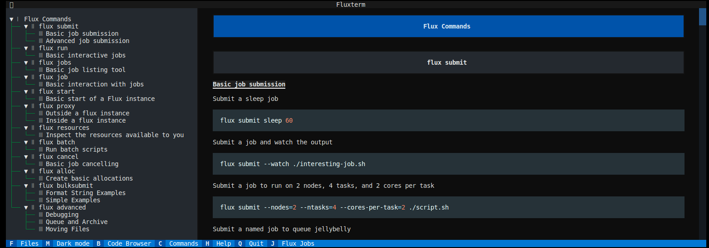
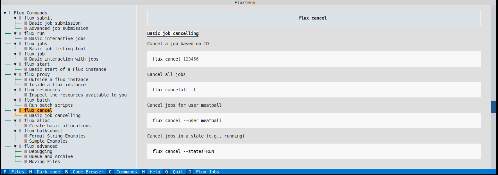
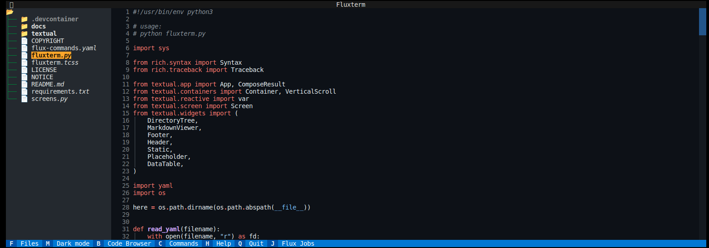
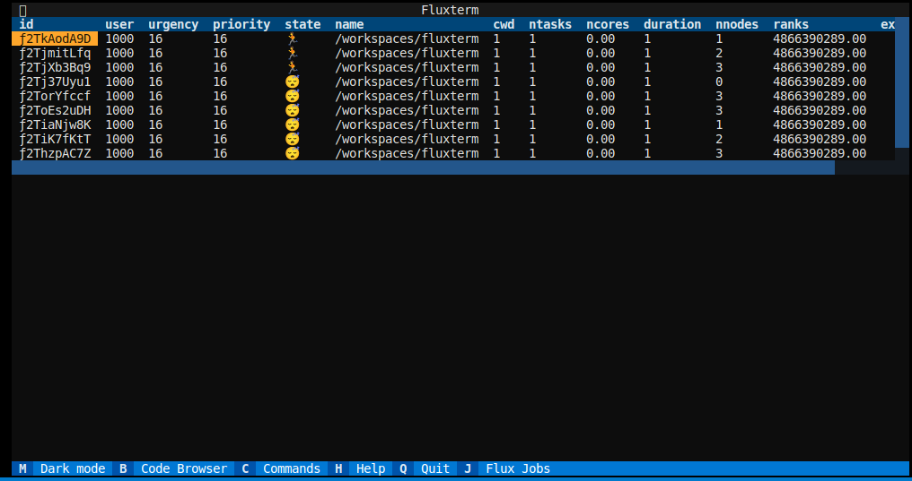
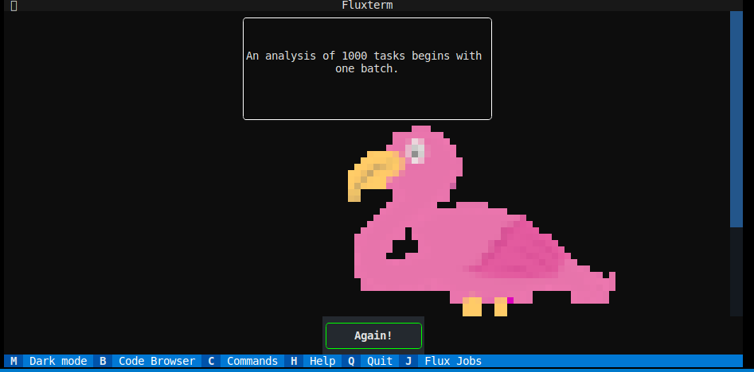

# Fluxterm

> 🦩️ I find this highly ridulous. And highly excellent.

Flux... from a terminal! This is a small terminal application that will provide a handle to interact with Flux, but also other useful UI interactions that are nice to have. We currently have:

- A simple code browser
- A flux jobs interface to see (and possibly TBA interact) with jobs
- A flux cheat sheet for quick reference

Coming soon:

- Fortune and wisdom from flux bird, the pink bird who knows things.

## Screenshots

The application enters with a code browser for the present working directory.

The cheat sheets isn't the complete Flux documentation, but offers a quick, command line reference.

The code browser is handy for navigating around your current directory of files.

The jobs table provides a quick interface to view flux jobs. We plan to add more interactivity to this,
for example, clicking a flux job to get more metadata or output.

Finally, if you ask for help? You get to talk with the "pink bird who knows things" Flux Bird.

If you'd like a feature added, please [let us know](https://github.com/flux-framework/fluxterm)! 
It is currently bare bones, and development of this project will happen per user request.

## TODO

- Turn into a pip-installable module proper
- Add emoji status to the jobs table
- Job table interactivity

## License

HPCIC DevTools is distributed under the terms of the MIT license.
All new contributions must be made under this license.

See [LICENSE](https://github.com/converged-computing/cloud-select/blob/main/LICENSE),
[COPYRIGHT](https://github.com/converged-computing/cloud-select/blob/main/COPYRIGHT), and
[NOTICE](https://github.com/converged-computing/cloud-select/blob/main/NOTICE) for details.

SPDX-License-Identifier: (MIT)

LLNL-CODE- 842614
